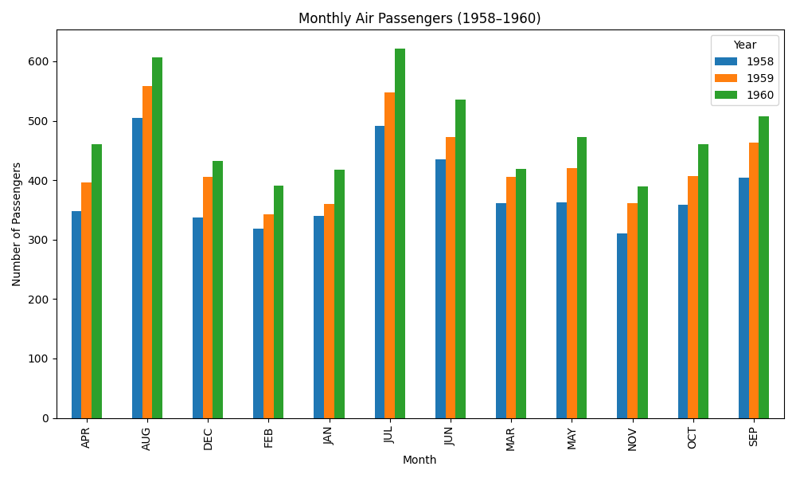

# 🧪 Mini Data Pipeline – Ingestion, Transformation & Dashboard


This project demonstrates a complete mini data pipeline using Python for ingestion, transformation, storage in a SQLite database, interactive visualization with Streamlit, and orchestration with Prefect.

---

## 📌 Objective

Build a realistic and minimal data pipeline that:
- Downloads public CSV data
- Transforms and cleans the dataset
- Loads the result into a SQLite database
- Displays the data in a live dashboard
- Executes the full flow using Prefect

---

## ⚙️ Pipeline Steps

1. **Ingestion** (`ingest.py`)  
   Downloads the raw dataset and saves it as `data/raw.csv`

2. **Transformation** (`transform.py`)  
   Cleans and reshapes the data into `data/cleaned.csv`

3. **Database Storage** (`save_to_db.py`)  
   Loads the cleaned data into a SQLite database `data/airtravel.db`

4. **Dashboard (Streamlit)** (`app.py`)  
   Visualizes the data interactively using Streamlit and matplotlib

5. **Orchestration (Prefect)** (`pipeline_flow.py`)  
   Runs the full pipeline as a managed flow

---

## 📊 Visualization Preview

This is the static version of the chart (from `visualize.py`):



To interact with the data dynamically, run the dashboard below.

---

## 🚀 Run the Interactive Dashboard

### Requirements

- Python 3.7+
- Libraries:
  `pandas`, `requests`, `matplotlib`, `sqlalchemy`, `streamlit`, `prefect`

Install dependencies:

```bash
pip install -r requirements.txt
